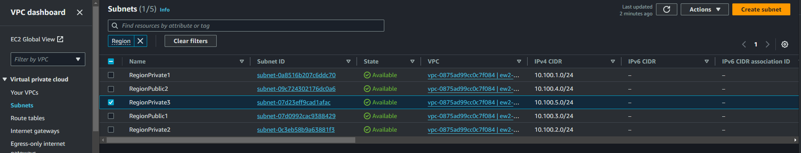

date: 16-09-2024

[AWS account we normally use](/images/aws_account.png)

Login there and go to VPCs

I found this entry here, not sure it is created manually

This seems to be linked with these network interfaces, this is prompted on trying to delete the subnet:

There, one of them is named assure-ew2-vpn, the other is poc-kinesis-stream...

 
It looks as if it was created manually, no cloudformation tags are there.
 
Would you mind taking a look at this and tell me anything else you can discover about it?
Questions are:
Can it be deleted? I guess not...
It is actually been used by the VPN?
I assume if these resources cannot be removed, then I need to ensure that the new AZ respects existing subnets and avoid clashing with them by using other subnet addresses

(Sent to Kowen)

(Kowen's answer)

If it's not in cloudformation then my gut is to be able to delete... Especilaly if in Experimental... Lets take a look 
 
I'm not sure how you got to network interfaces but I always find the easiest way is to 'nearly delete' or actually try and delete the resource; aws gives you hints as to what might still be attached. Maybe not the best way to do it but I get this output:

That's a bit annoying so lets solve one mystery; kinesis. The interface type is set to vpc endpoint; so if we go to the vpc -> [endpoints](https://eu-west-2.console.aws.amazon.com/vpcconsole/home?region=eu-west-2#Endpoints:) we can see it listed there:

 
We can see that there is a subnet listed, Simply click managed subnets and deassociate the vpc endpoint from your regionprivate3 subnet. We can deduce four things which I'd say will be fine to delete/deassociate:
Seeing as there are no other network interfaces associated with that subnet the vpc endpoint network interface is probably not being used (barring any weird routing things where it's being routed to from other subnets, but lets assume this is true)
the label is 'POC' without any name tag on it and created nearly a year ago. I suspect someone has created it and forgotten about it.
Experimental is low use and probably not gonig to impact anyone.
We can always add the subnet back in after adding the 3rd az later.
I actually wouldn't even hesitate deleting the whole vpc endpoint but I don't mind getting in trouble 
 
Now. As for the ClientVPN we can get to it by going to vpc -> ClientVPN endpoints -> assure-ew2-vpn
Same principle applies; we can deassociate the target network, add the new region private3 subnet with cloudformation then add reassociate the target network.
 
 
TL;DR detach the subnet required for the client vpn and kinesis vpn endpoints, add your new subnet using CFN then reassociate the subnets to the endpoints respectively.
