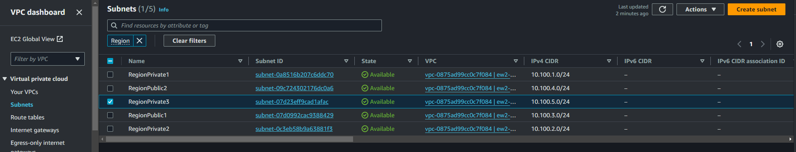
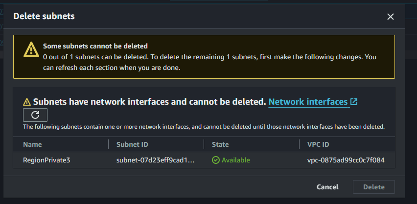
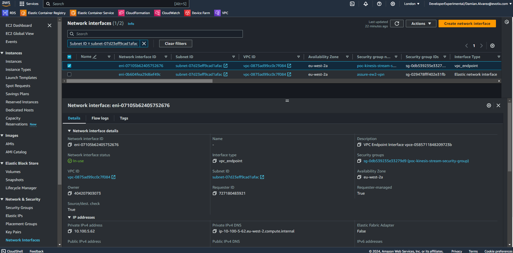
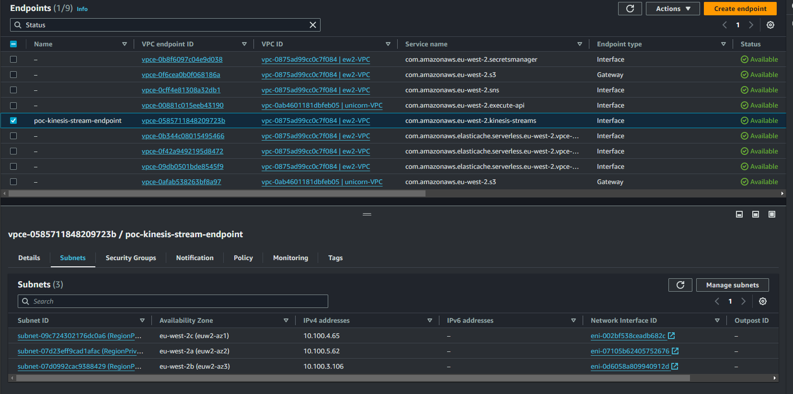
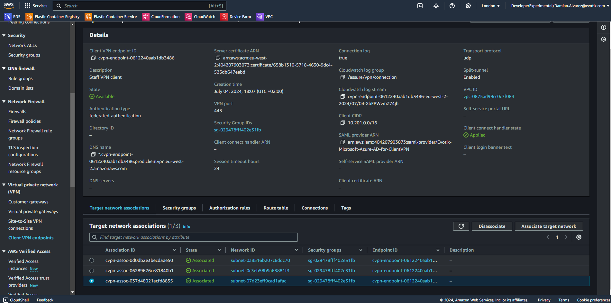
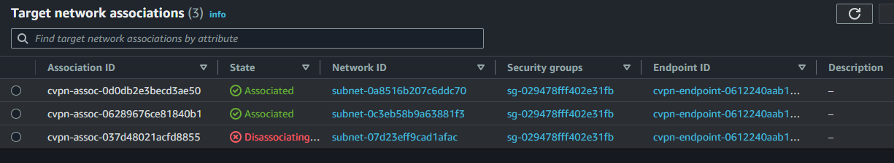
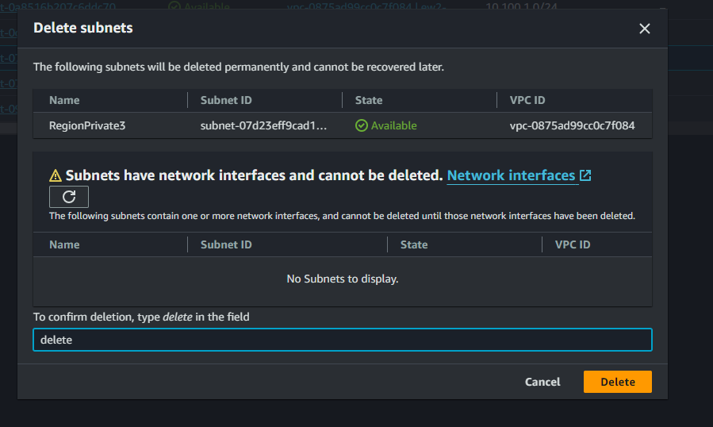
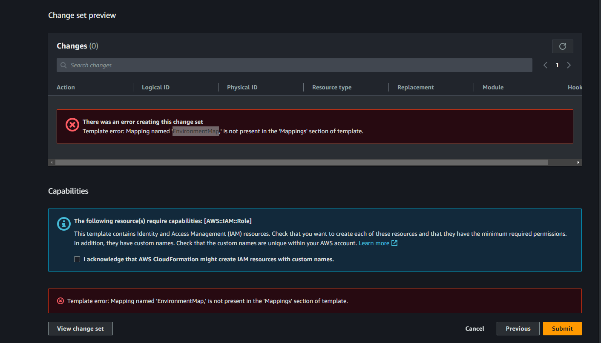
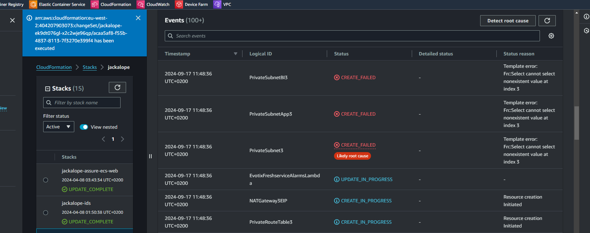

date: 17-09-2024

Start from AWS VPCs > Go to Subnets, filter by 'Region'

Actions > Delete subnet (RegionPrivate3 selected)

Network interfaces, filter by VPC ID 'vpc-0875ad99cc0c7f084'

Click on vpc link and select Endpoints in the left nav bar, filter by 'vpc-0875ad99cc0c7f084'

Select poc-kinesis-stream-endpoint and below Subnets

Click on 'Manage subnets' deassociate target network

Removed subnet-07d23eff9cad1afac

Here disassociate Network ID subnet-07d23eff9cad1afac

Confirm delete subnet RegionPrivate3

Now changes done in templates, first upload/apply region.template

Trying to apply changes on stack.template first I got this error:

